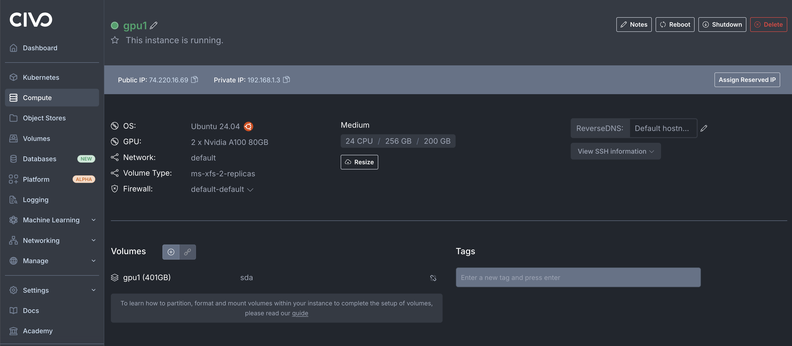
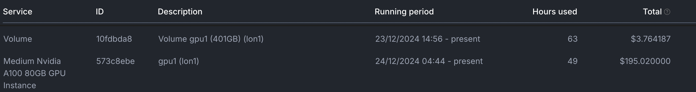
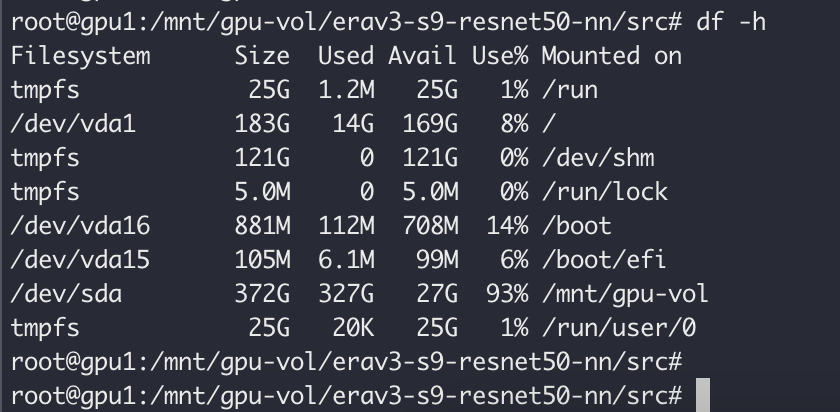
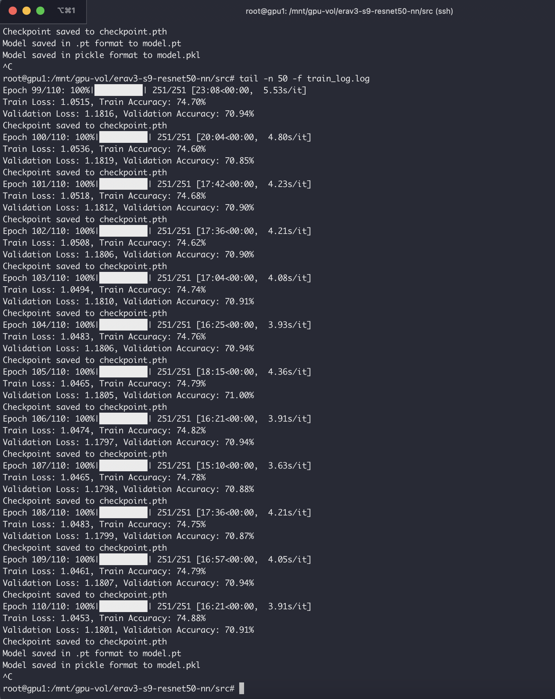
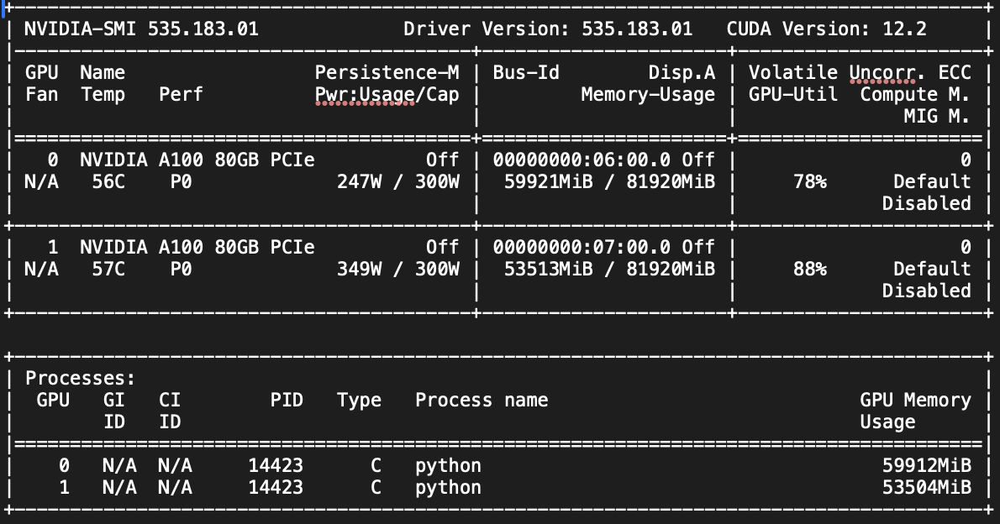

# ResNet-50 Image Classification on ImageNet-1k

This project implements a ResNet-50 model from scratch using PyTorch to classify images from the ImageNet-1k dataset. The model is designed to achieve a top-1 accuracy of over 70% on the validation set.

## Table of Contents
- [Overview](#overview)
- [Requirements](#requirements)
- [Installation](#installation)
- [Usage](#usage)
- [Utility Functions](#utility-functions)
- [Directory Structure](#directory-structure)
- [Logging](#logging)
- [Model Training](#model-training)
- [Actual Training](#actual-training)
- [License](#license)

## Overview

ResNet (Residual Network) is a type of convolutional neural network (CNN) that uses skip connections to allow gradients to flow through the network more effectively during training. This implementation includes:
- Data loading and preprocessing
- ResNet-50 architecture
- Training and validation loops
- Progress tracking with `tqdm`
- Checkpointing to resume training in case of interruptions
- Saving the trained model in both `.pt` and pickle format
- Modular configuration management for easy adjustments
- Utility functions for model evaluation and management

### Key Features
- **Mixed Precision Training**: Utilizes PyTorch's automatic mixed precision (AMP) for efficient training on compatible hardware.
- **Checkpointing**: Save and load model checkpoints to resume training seamlessly.
- **Top-k Accuracy Calculation**: Evaluate model performance using top-k accuracy metrics.

## Requirements

- Python 3.6 or higher
- PyTorch (1.12.0 or higher)
- torchvision (0.13.0 or higher)
- tqdm (4.62.0 or higher)
- pickle (included in Python standard library)

## Installation

1. Create a virtual environment (optional but recommended):
   ```bash
   python -m venv venv
   ```

2. Activate the virtual environment:
   - On Windows:
     ```bash
     venv\Scripts\activate
     ```
   - On macOS and Linux:
     ```bash
     source venv/bin/activate
     ```

3. Clone the repository:
   ```bash
   git clone https://github.com/milindchawre/erav3-s9-resnet50-nn.git
   cd erav3-s9-resnet50-nn
   ```

4. Install the required packages:
   ```bash
   pip install -r requirements.txt
   ```

## Usage

1. Configure the training parameters in `src/config.py`:
   - You can set the following parameters: (mostly based on some trial and error on your training machine)
     - `DATA_DIR`: Directory for storing the ImageNet dataset (default: `"imagenet-dataset"`).
     - `NUM_EPOCHS`: Number of training epochs (default: `110`).
     - `BATCH_SIZE`: Batch size for training (default: `5120`).
     - `LEARNING_RATE`: Learning rate for the optimizer (default: `0.05`).

2. Ensure that the dataset is structured correctly: (imagenet1k dataset is downloaded from [kaggle](https://www.kaggle.com/c/imagenet-object-localization-challenge/data))
   - The training and validation images should be organized in the following way:
     ```
     imagenet-dataset/
     ├── ILSVRC/
     │   ├── Data/
     │   │   └── CLS-LOC/
     │   │       ├── train/
     │   │       │   ├── class1/
     │   │       │   └── class2/
     │   │       └── val/
     │   │           ├── class1/
     │   │           └── class2/
     ```

3. The downloaded validation dataset is not in correct format inside sub class folders (the training data is correctly placed). We make use of [this script](./src/convert_val.py) to correct the validation data format.
```
cd src
python convert_val.py -d ./imagenet/ILSVRC/Data/CLS-LOC/val -l ./imagenet/LOC_val_solution.csv
```

4. Follow steps listed in [Model Training Section](#model-training)

The model will not automatically download the ImageNet dataset if it is not present. Ensure that the dataset is correctly placed in the specified directory. Training progress, loss, and accuracy will be printed to the console. The model will be saved in both `.pt` and pickle format after training, and checkpoints will be saved as `checkpoint.pth` after each epoch.

## Utility Functions

The `src/utils.py` file contains utility functions that assist in model evaluation and management:
- **`top_k_accuracy(output, target, k=5)`**: Calculates the top-k accuracy of the model's predictions.

Note: The functions for saving and loading the model and top1 accuracy calculation are implemented in `src/train.py`.

## Logging

Redirect your training logs in appropriate file for later analysis. Training logs are saved in `src/train_log.log` and `src/training_logs.log`, which include:
- Training and validation loss and top1 accuracy for each epoch.
- Checkpointing information.

## Directory Structure

```
erav3-s9-resnet50-nn/
│
├── src/
│   ├── config.py              # Configuration file for parameters
│   ├── data_loader.py         # Data loading and preprocessing
│   ├── model.py                # ResNet-50 model definition
│   ├── train.py                # Training and validation logic
│   └── utils.py                # Utility functions (e.g., top-k accuracy)
│
├── requirements.txt             # Required packages for installation
└── README.md                    # Project documentation
```

## Model Training

This model is trained on the ImageNet-1k dataset using a ResNet-50 architecture. The training process is designed to be efficient and scalable, leveraging mixed precision training and checkpointing for optimal performance.

### Training Environment

- **Hardware**: The model is optimized for training on GPUs. It is recommended to use NVIDIA GPUs with CUDA support for faster training.
- **Software**: Ensure that the required packages are installed as specified in `requirements.txt`. The project is compatible with Python 3.6 or higher.

### Training Process

1. **Configuration**: Before starting the training, configure the training parameters in `src/config.py`. Key parameters include:
   - `DATA_DIR`: Path to the ImageNet dataset.
   - `NUM_EPOCHS`: Total number of epochs for training (default: `110`).
   - `BATCH_SIZE`: Size of the training batches (default: `512`).
   - `LEARNING_RATE`: Learning rate for the optimizer (default: `0.05`).

2. **Data Preparation**: Ensure that the ImageNet dataset is organized correctly in the specified directory structure. The training and validation images should be placed in their respective class folders.

3. **Start Training**: Execute the training script by running:
   ```bash
   cd src
   python train.py
   ```

4. **Monitoring Progress**: During training, the console will display:
   - Training and validation loss for each epoch.
   - Training and validation accuracy metrics.
   - Progress bars for each epoch using `tqdm`.

5. **Checkpointing**: The model's state will be saved at the end of each epoch in a file named `checkpoint.pth`. This allows you to resume training from the last saved state in case of interruptions.

6. **Model Saving**: After training completes, the final model will be saved in both `.pt` and pickle format for easy loading and inference.

### Expected Outcomes

- **Training Loss**: The training loss should decrease over epochs, indicating that the model is learning.
- **Validation Accuracy**: The validation accuracy should improve, ideally reaching over 70% top-1 accuracy on the ImageNet validation set.
- **Logs**: Training logs will be saved in `src/train_log.log` and `src/training_logs.log`, providing detailed insights into the training process.

### Notes

- Ensure that your environment has sufficient GPU memory to handle the specified batch size. Adjust the `BATCH_SIZE` parameter if you encounter memory issues.
- Mixed precision training is enabled by default for improved performance. Ensure your hardware supports this feature for optimal results.

## Actual Training

The model was trained on a virtual machine equipped with 2 A100 GPU devices. The entire training process took approximately 2 days, which includes 1.5 days dedicated to the actual model training and an additional 0.5 days spent on configuring the GPU VM, downloading and unarchiving the ImageNet dataset, and setting up the necessary volume configurations.

During training, the batch size was set to 5120 to maximize GPU memory utilization, and the training was conducted over 110 epochs to achieve a top-1 accuracy exceeding 70%.

### Machine Spec

**Actual GPU VM**


**Machine Cost**


**Disk Spec**


**Training Logs**


**Actual GPU Usage - nvidia-smi command**


## License

This project is licensed under the MIT License. See the [LICENSE](LICENSE) file for details.
