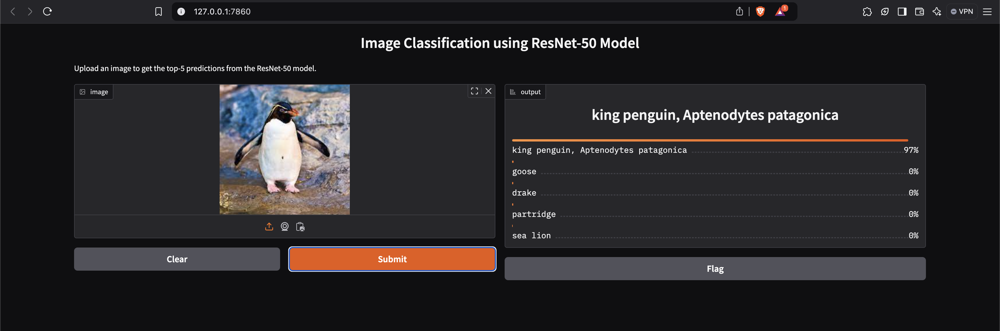

# Image Classification using ResNet-50 Model on Hugging Face Spaces

This application hosts a ResNet-50 model trained from scratch to classify images using the Hugging Face Spaces platform ([model training code can be found here](https://github.com/milindchawre/erav3-s9-resnet50-nn)). Users can upload images, and the model will return the top-5 predictions along with their probabilities.

## Features

- **Image Upload**: Users can upload any image for classification.
- **Top-5 Predictions**: The model provides the top-5 predicted classes with their corresponding probabilities.
- **User-Friendly Interface**: Built using Gradio, the app offers an intuitive interface for easy interaction.

## Requirements

The application requires the following Python packages:

- `torch`
- `torchvision`
- `gradio`
- `Pillow`

These packages are specified in the `requirements.txt` file.

## Directory Structure

```
huggingface-app/
│
├── app.py                    # Main application file for the Hugging Face Spaces app
├── requirements.txt           # Required packages for the Hugging Face app
└── model.py                   # ResNet-50 model definition
```

## How to Use

1. **Clone the Repository**: If you haven't already, clone the repository containing the app.
   ```bash
   git clone https://github.com/yourusername/erav3-s9-resnet50-nn.git
   cd erav3-s9-resnet50-nn/huggingface-app
   ```

2. **Install Dependencies**: Install the required packages using pip.
   ```bash
   pip install -r requirements.txt
   ```

3. **Run the App Locally** (optional): You can test the app locally before deploying it to Hugging Face Spaces.
   ```bash
   python app.py
   ```

4. **Deploy to Hugging Face Spaces**: 
   - Create a new Space on [Hugging Face Spaces](https://huggingface.co/spaces).
   - Upload the contents of the `huggingface-app` directory.
   - The app will automatically build and be ready for use.

## How to Use the App

1. **Open the App**: Navigate to your Hugging Face Space URL.
2. **Upload an Image**: Click on the upload button to select an image from your device.
3. **Get Predictions**: After uploading, the model will process the image and display the top-5 predictions with their probabilities.

## Example Output

After uploading an image, you will see output similar to the following:



## License

This project is licensed under the MIT License. See the [LICENSE](../LICENSE) file for details.

## Acknowledgments

- The ResNet-50 architecture is based on the original paper by Kaiming He et al.
- Thanks to the Hugging Face community for providing the platform to deploy machine learning models easily. 